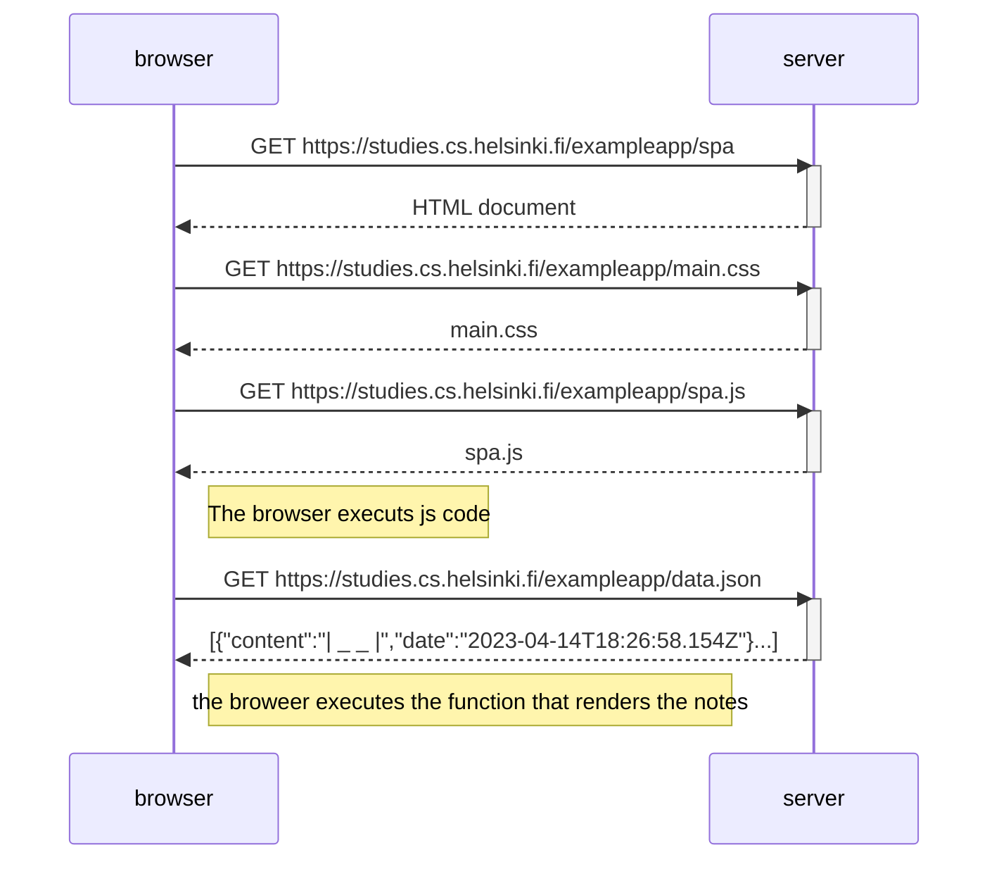

```mermaid
sequenceDiagram
    participant B as browser
    participant S as server

    B ->> S: GET https://studies.cs.helsinki.fi/exampleapp/spa
    activate S
    S -->> B:  HTML document
    deactivate S

    B ->> S: GET https://studies.cs.helsinki.fi/exampleapp/main.css
    activate S
    S -->> B: main.css
    deactivate S

    B ->> S: GET https://studies.cs.helsinki.fi/exampleapp/spa.js
    activate S
    S -->> B: spa.js
    deactivate S
    note right of B: The browser executs js code

    B ->> S: GET https://studies.cs.helsinki.fi/exampleapp/data.json
    activate S
    S -->> B: [{"content":"| _ _ |","date":"2023-04-14T18:26:58.154Z"}...]
    deactivate S

    note right of B: the broweer executes the function that renders the notes
```