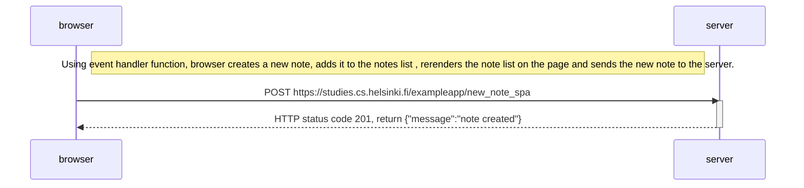

```mermaid
sequenceDiagram
    participant B as browser
    participant S as server

    Note right of B: Using event handler function, browser  creates a new note, adds it to the notes list , rerenders the note list on the page and sends the new note to the server.
    B ->> S: POST https://studies.cs.helsinki.fi/exampleapp/new_note_spa
    activate S
    S -->> B:  HTTP status code 201, return {"message":"note created"}
    deactivate S
```